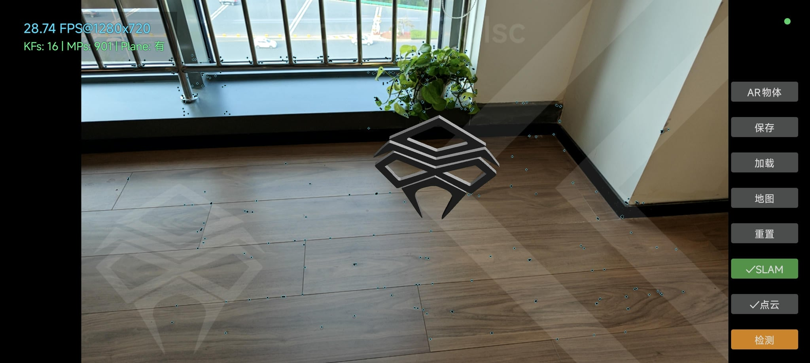
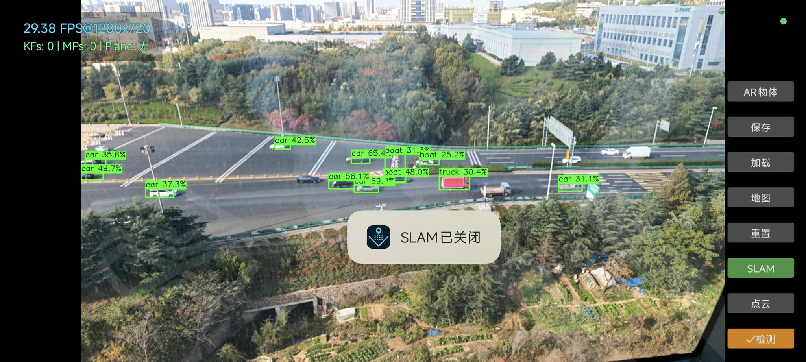

## 维点域SLAM（精简版概览）

[中文](README.md) | [English](README_EN.md) | [日本語](README_JA.md)

**📖 [查看完整技术文档 WIKI](WIKI.md)**

本项目是一个面向 Android 的视觉 SLAM 与基础 AR 演示应用。系统在移动端实现了实时稀疏点云建图、地图持久化与重定位、平面检测，以及 OpenGL 渲染的 AR 对象展示。

> 说明：系统使用了经过改造的 ORB 思路（可理解为"魔改 ORB"），但实现细节与项目结构在本文暂时不作展开。

---

**[点击下载 v0.0.1 版本](https://github.com/ZUXTUO/Vtonax_SLAM_Public/releases/tag/v0.0.1)**

---

### 主要特性

- 实时单目建图与位姿追踪
- 地图保存/加载与快速重定位
- 点云可视化与平面检测
- AR 对象放置与交互渲染
- 目标检测（可选），与 SLAM 并行

### 效果展示

#### SLAM 部分

#### YOLO 部分

---

### 运行环境

- Android 5.0+，支持 ARMv7a 或 ARM64-v8a
- 需要摄像头权限与基本的图形/计算能力
- 推荐使用骁龙835及以上的CPU，理论上支持更低级CPU但没做太多测试
- Yolo部分需要Vulkan支持，会自动检测本机是否支持开启此功能

---

## 使用提示

- 初次进入请缓慢平移设备，获取稳定追踪后再进行平面检测与 AR 放置。
- 重定位时，系统会在识别到足够一致的特征后自动对齐。
- 如需更高性能，可关闭额外可视化或目标识别功能。

---

目前支持中文和英文。 
还在测试中，可能有很多BUG。 
主要用于验证。 
此安装包不可用于商业环境。 
主要以研究学习为主。 