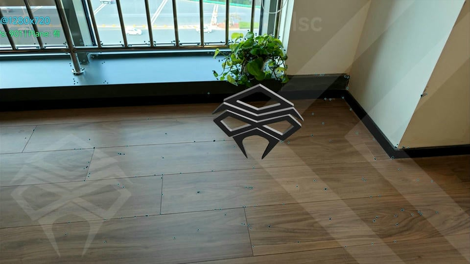
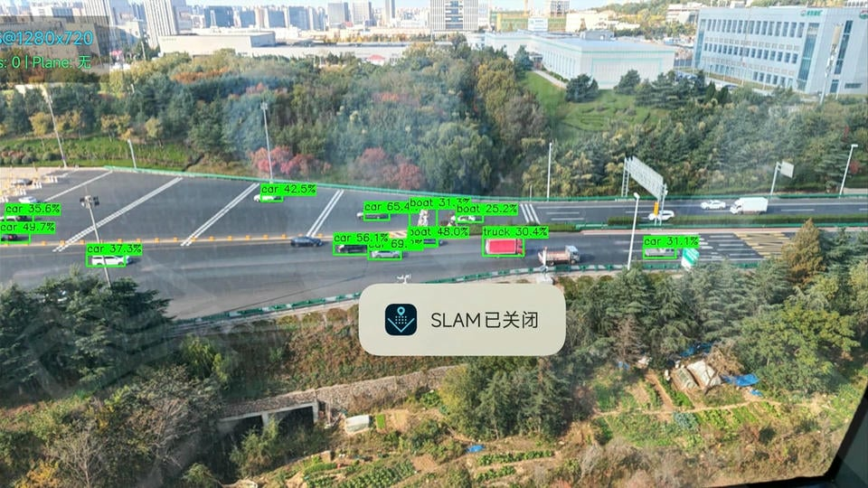
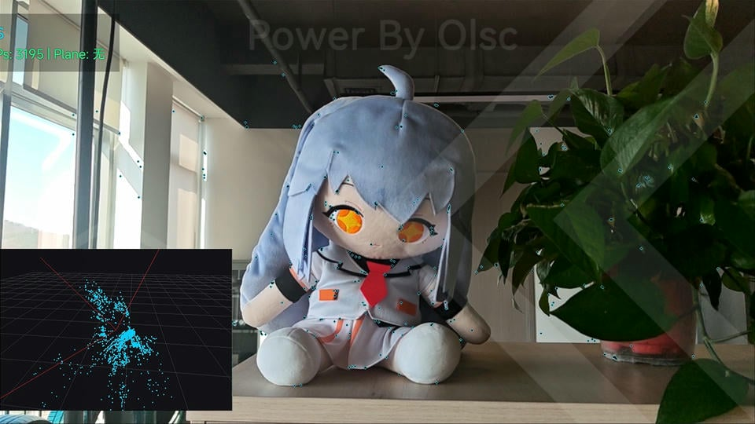

## Vtonax SLAM (Simplified Overview)

[中文](README.md) | [English](README_EN.md) | [日本語](README_JA.md)

**📖 [View Complete Technical Documentation WIKI](WIKI_EN.md)**

This project is a visual SLAM and basic AR demonstration application for Android. The system implements real-time sparse point cloud mapping, map persistence and relocalization, plane detection, and AR object display with OpenGL rendering on mobile devices.

> Note: The system uses a modified ORB approach (which can be understood as "customized ORB"), but implementation details and project structure are not elaborated in this document.

---

**[Download v0.0.1](https://github.com/ZUXTUO/Vtonax_SLAM_Public/releases/tag/v0.0.1)**
**[Download v0.0.2](https://github.com/ZUXTUO/Vtonax_SLAM_Public/releases/tag/v0.0.2)**

---

### Main Features

- Real-time monocular mapping and pose tracking
- Map save/load and fast relocalization
- Point cloud visualization and plane detection
- AR object placement and interactive rendering
- Object detection (optional), running in parallel with SLAM

### Demo

#### SLAM Part

#### YOLO Part

#### Visualization Window Part

---

### System Requirements

- Android 5.0+, supporting ARMv7a or ARM64-v8a
- Camera permission and basic graphics/computing capabilities required
- Recommended Snapdragon 835 or higher CPU, theoretically supports lower-end CPUs but not extensively tested
- YOLO part requires Vulkan support, will automatically detect and enable this feature if available

---

## Usage Tips

- On first launch, slowly move the device to obtain stable tracking before proceeding with plane detection and AR placement.
- During relocalization, the system will automatically align once enough consistent features are recognized.
- For higher performance, disable additional visualization or object recognition features.

---

Currently supports Chinese and English. 
Still in testing, may have many bugs. 
Mainly for verification purposes. 
This package is not for commercial use. 
Primarily for research and learning. 
